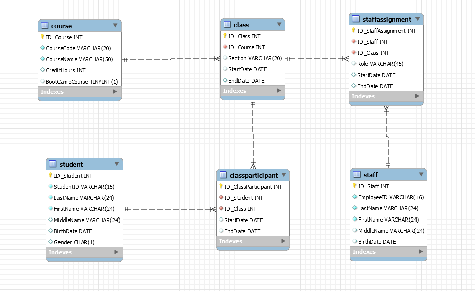
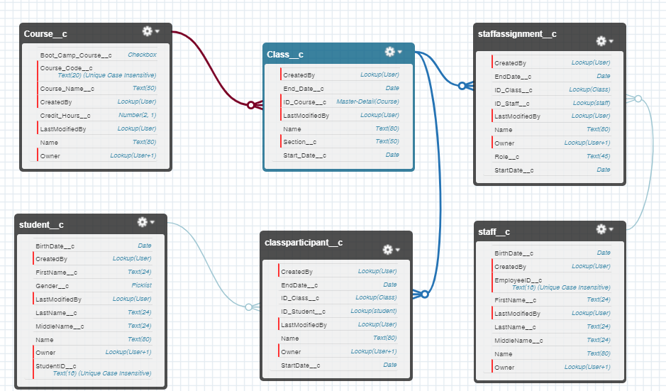
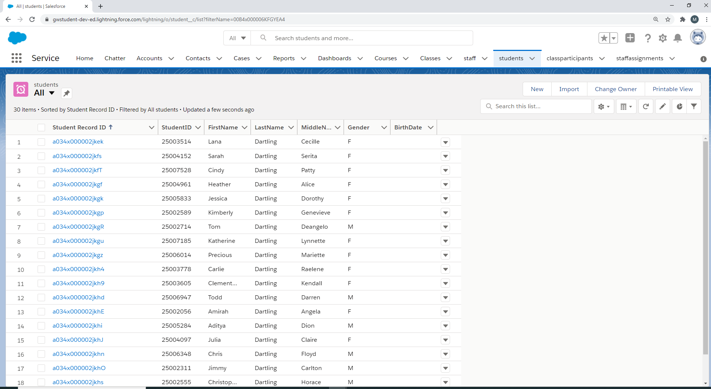
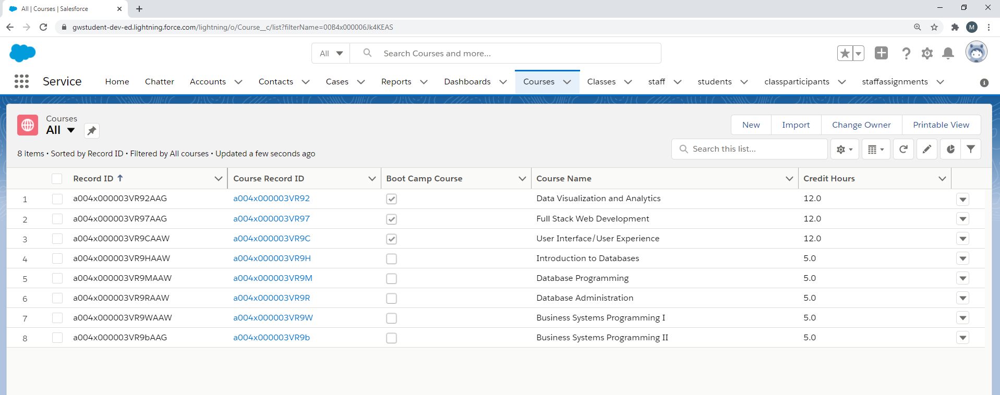
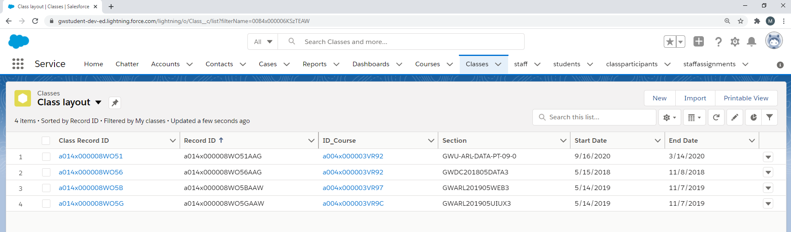
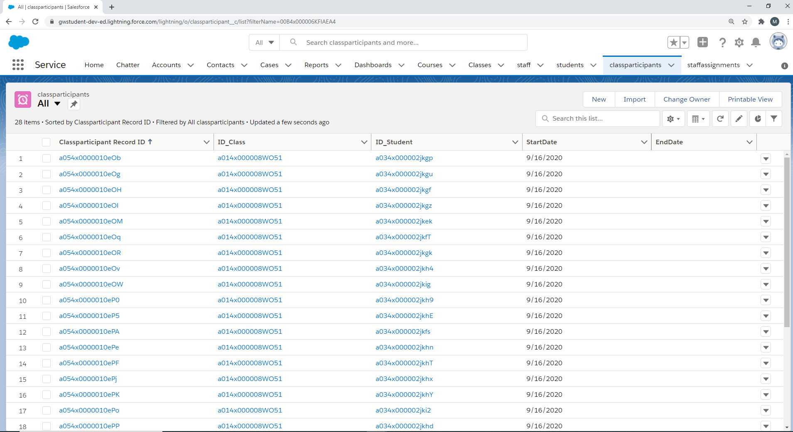
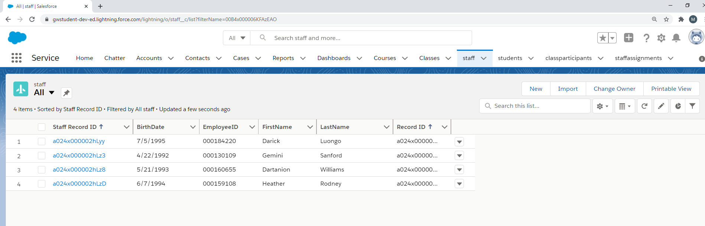
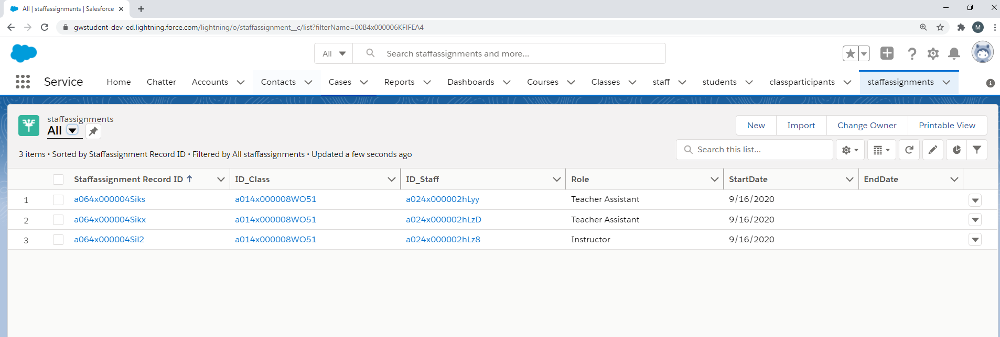

# ETL Project

In this ETL assignment data was migrated from a cloud MySQL database, hosted on Amazon Web Services (AWS) to a Salesforce application.

## Database Setup
A MySQL database was set up with a GWSIS object. The following tables were creted and data was loaded using queries. The entity relationship diagram (ERD) is shown below.

## Salesforce
The following custom objects were set up in salesforce. The entity relationship diagram (ERD) is shown below.

* Student
* Course
* Class
* Class Participant
* Staff
* Staff Assignment

## Data Movement (ETL)
An ETL process was developed in Python and was used to load each table in Salesforce from an MySQL database on AWS.

## Salesforce visuals

## 1. Student table

## 2. Course table

## 3. Class table

## 4. Class Participant junction table

## 5. Staff table

## 6. Staff Assignment table
